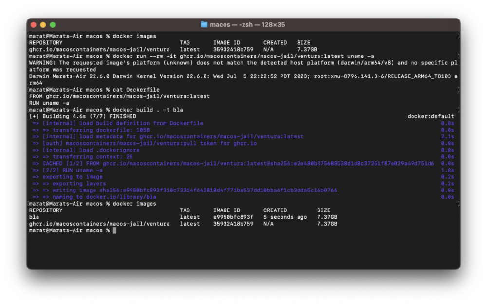

{::nomarkdown}

{:/}

# macOS Containers

Containers have fundamentally changed the way that modern software is developed and deployed. Containers are supported by a wide range of operating systems including FreeBSD, Solaris, Linux and even Windows, but are not natively supported by macOS. **Until now.**

We're announcing initial release of macOS native containers.  Yes, you can now **run macOS inside macOS**, build images using Docker and distribute them using registries.

So what are you waiting for? Installation is available via [Homebrew](https://github.com/macOScontainers/homebrew-formula#installation).

	
Mac and macOS are trademarks of Apple Inc., registered in the U.S. and other countries and regions.

	
This website is an independent community initiative and has not been authorised, sponsored, or otherwise approved by Apple Inc.

